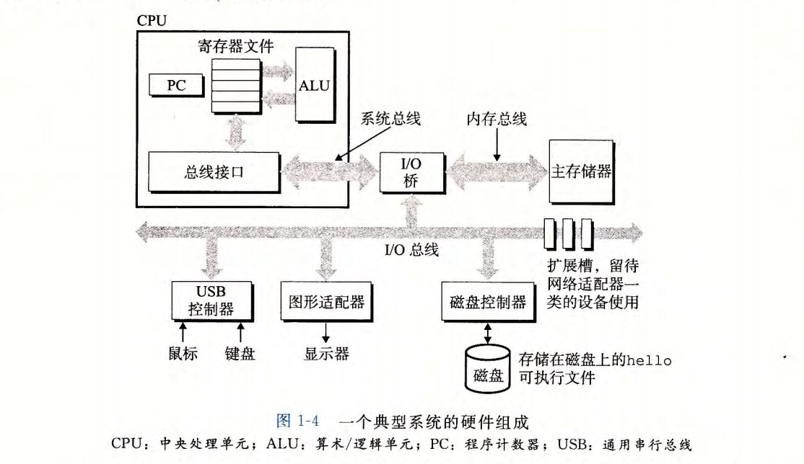

计算机系统是由硬件和系统软件组成的， 共同工作来运行应用程序。 一些程序员希望深入了解这些组件如何工作、如何影响程序正确性和性能， 这本书就是为这些读者而写。

如果全力投身于本书中概念，完全理解计算机系统及对应用程序的影响，那么你将成为一名更好的程序员，踏上那道孤独的**大牛**道路。

且看这段代码:

```C
#include <stdio.h>
int main() {
    printf("Hello, world\n");
    return 0;
}
```

跟随这段代码来开始对系统的学习。

## 1 信息就是位 + 上下文

1. 源程序中由值 0 和 1 组成的**位(又称比特)**序列，8个位组成一组，成为**字节**， 每个字节表示程序的某些**文本字符**
2. 现代计算机使用**ASCII**编码来表示文本字符， 例如字母 "i" 的 ASCII 码是十进制的 105
3. **只有ASCII字符构成的文件成为 文本文件。**。 其他文件都被称为**二进制文件**， 例如可执行文件、图像文件和音频文件
4. 基本思想： **系统所有信息都由 一串比特表示。 区分的唯一方法就是读取数据的上下文。**
5. 一个同样字符不同上下文，可能表示整数、浮点数、字符串、机器指令。 程序员需要了解数字的机器表示方式。

## 2 程序会被编译

hello程序是高级C语言程序， 这种形式是为了被**人**读懂。  为了计算机可运行， 每条C语句都被编译转换为一系列的**低级机器指令**。 **指令**按照**可执行目标程序**的格式打包存储为 **二进制磁盘文件**

> 目标程序也被称为**可执行目标文件**。

### 2.1 编译过程

在Unix中， 转化通常是由**编译驱动程序**(例如gcc)完成的。 一共四个阶段

`linux -> gcc -o hello.c`

- 预处理(cpp): 处理以 # 开头的预处理指令， 例如 #include 和 #define。 生成纯C代码文件, 例如 hello.i
- 编译(ccl): 将纯C代码翻译为**汇编语言**， 生成 hello.s 文本文件
- 汇编(as): 将汇编语言翻译为**机器代码指令** hello.o 二进制文件
- 链接(ld): 将目标文件与所需的库函数连接， 生成最终的可执行文件 hello

## 3 了解编译系统工作

理解编译系统的工作原理， 有助于编写更高效的代码。 例如： 

### 3.1 优化程序性能

现代编译器已经成熟，我们无须去了解编译器内部工作。 但是为了做出好的编码选择， 需要了解一些机器代码、编译器将不同C语句转换机器代码的方式。 比如一个`switch`语句和`if/else`、函数调用、`while`比`for`循环的性能差异。

指针引用比数组索引更有效? 循环求和结果放在新变量，而不是引用传递的参数更高效? 了解这些细节， 可以编写出更高效的代码。

第三章，将介绍x86-64指令集架构， 以及编译器如何将C代码转换为x86-64机器代码。

第五章， 学习通过简单转换C语言代码，帮助编译器更好完成工作

第六章， 学习存储器系统的层次结构特性， 编译器如何将数组存放在内存中。

### 3.2 理解链接时出现的错误

一些最令人困扰错误往往都与链接器操作有关， 尤其是构建大型软件系统时。

比如： 链接器报告无法解析一个引用? 静态变量和全局变量的区别? 不同C文件定义了名字相同的两个全局变量会发生什么? 静态库和动态库的区别? 

答案便在**第七章**

### 3.3 避免安全漏洞

缓冲区溢出错误是造成大多数网络和Internet服务器安全漏洞主要原因。  存在这些错误是很少有程序员可以理解数据和控制信息存储在程序栈上的方式会引起的后果。

答案在**第三章**

## 4 处理器读并解析存储在内存中的指令

此刻， `hello.c`源程序已经被编译系统编译为了可执行目标文件`hello`， 并存放在磁盘上。

在 Unix系统中运行， 将文件名输入到`shell`的应用程序中

```shell
linux> ./hello
Hello, world
linux>
```

### 4.1 系统硬件

理解程序运行发生什么， 需要了解一个典型系统的**硬件组织**。  下图则是近期Inter系统产品组的模型。



#### (1) 总线

贯穿整个系统的是一组电子管道， 称之为**总线**。 携带信息字节并负责在各个部件间传递。 

通常总线被设计成传送**定长的**字节快， 也就是字**word**， 字中的字节数(即字长)是一个基本的系统参数

> 现代系统大多数的机器字长是4个字节(32位), 要不是8个字节(64位)

#### (2) I/O设备

I/O(input/output)设备负责系统与外部物理世界的联系通道

本图中有4个I/O设备， 分别是用户**input**的键盘、鼠标， 用户**output**的显示器， 以及存储数据和程序的磁盘驱动器

每个I/O设备都通过一个控制器或是适配器与I/O总线连接。

控制器是I/O设备本身或系统的主印制电路板(主板)上的芯片组。 而适配器是插在主板插槽的卡。

> 功能都是在I/O总线和I/O设备之间传递信息


#### (3) 主存

主存是一个临时存储设备， 用于处理器执行程序时， 存放程序和临时处理的数据。 

物理上来说是一组 **动态随机存取存储器(DRAM)** 芯片，

**第六章**将详细介绍主存的组织结构和工作原理。

#### (4) 处理器

中央处理单元(CPU)， 简称处理器。 是解释或执行存储在主存中指令的引擎。 

处理器的核心是一个大小为一个字的存储设备(寄存器)， 称之为**程序计数器(PC)**。 

> 任何时候， PC都指向主存的某条机器语言指令(即含有该条指令的地址)。

系统运行， 处理器就不断执行程序计数器指向的指令， 然后更新PC以指向下一条指令。 整个模型是由**指令集架构**决定的。

最简单的操作步骤是： CPU从PC指向的内存处读取指令， 解释指令中的位， 执行指令指定的操作， 然后更新PC， 继续执行。

这样简单操作不多，主要围绕着 主存、寄存器文件、算术/逻辑单元(ALU) 进行。

**第三章**将详细介绍x86-64指令集架构。

**第四章**是详细处理CPU如何实现

**第五章**是一个模型说明现代CPU如何工作

### 4.2 运行程序

