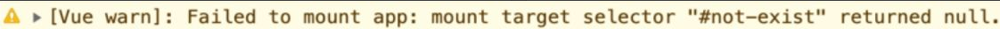
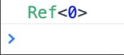

# 框架设计核心要素

框架设计不止要功能，还有很多取舍： 提供哪些构建产物、产物的模块格式、预期外错误使用框架是否打印合适警告信息、开发和生产版本区别、热更新的框架底层支持。

## 提升开发体验

在vuejs3中，可以举一个控制台打印来优化开发体验的例子：

如下挂载了一个不存在元素

```js
createApp(App).mount('#not-exist')
```

那么vue会在控制台打印内容



还有就是关于`Ref`等的类型打印



## 控制代码体积

每一个warn函数的调用都会配合`__DEV__`常量的检查：

```js
if (__DEV__ && !res) {
  warn(
          `Failed to mount app: mount target selector "${container}"returned null.`
  )
}
```

这样在生产版本中，所有的warn调用都会被删除，从而减小代码体积。

## tree-shaking

vue内置的组件如`Transition`, 如果不使用，那么就不需要包含在项目最终的构建资源

Tree-Shaking 指的就是消除那些永远不会被执行的代 码，也就是排除 dead code。

> 想要实现 Tree-Shaking，必须满足一个条件，即模块必须是 ESM（ES Module），因为 Tree-Shaking 依赖 ESM 的静态结构。

以`rollup`为例， 使用命令`npx rollup input.js -f esm -o bundle.js`打包后， 未引入组件、方法的代码不会出现在构建结果中，
这是基本的作用

tree-shaking第二个关键点是 **副作用** ，即 **函数调用会对外部产生影响，如修改了全局变量** 。

静态地分析js代码很困难，如果是访问一个本地对象，但是是经过了`proxy`代理的对象，那么就无法静态分析出这个对象是否会被修改。

所以`rollupjs`提供`/*#__PURE__*/`注释，来标记某个函数调用是无副作用的， 这样在tree-shaking时就可以删除这些调用。

:::code-group

```js[utils.js]
export function foo(obj) {
    obj && obj.foo  
}
export function bar(obj) {
  obj && obj.bar
}
```

```js[input.js]
import { foo } from './utils.js'
// 告诉 rollup 这个函数调用是无副作用的 可以移除
/*#__PURE__*/ foo()
```

```js[bundle.js]
// 打包结果为空
```

:::

## 输出怎样的构建产物?

不同类型产物一定有不同需求：

### HTML引入

vuejs用法之一是 希望用户可以在HTML页面使用`<script>`标签引入vuejs脚本

`rollup`打包时， 需要指定`output.format`为`iife`， 输出IIFE格式资源

### ESM格式

输出`vue.esm-browser.js`， 供现代浏览器使用ESM模块引入， 使用`<script type="module" src="vue.esm-browser.js"></script>`

还有对应的`-bundle.js`格式， 供打包工具如`webpack`、`rollup`等使用

> vuejs源码中，`packages/vue/package.json`中给打包工具指定了

### nodejs引入

还希望在nodejs中`const vue = require('vue')`使用， 需要输出`cjs`格式产物

原因则是： **服务端渲染**

## 特性开关

多特性提供对应开关，通过设置为`true`或`false`来决定是否引入某个特性

:::tip
好处是：
- 关闭特性，通过tree-shaking移除不必要代码，减小体积
- 框架升级可以通过开关支持遗留API
:::

vuejs有大量，有一个`__VUE_OPTIONS_API__`开关， 用于控制是否支持`Options API`语法, 源码中有大量此类判断分支。

## 错误处理

错误处理是框架设计中重要一环！决定了app的健壮性和开发时的心智负担。

**假设我们开发了一个工具类， 操作某些本身的逻辑后，调用用户传入的回调函数**。 那么如果callback抛出错误， 我们应该如何处理？

我们代替用户在入口增加`try...catch`，捕获错误， 再**给入口让用户注册全局错误处理函数**， 让用户决定如何处理错误。

:::code-group

```js[utils.js]
let handleError = null
export default {
    foo(fn){
        callWithErrorHandling(fn)
    },
    registerErrorHandler(handler){
        handleError = handler
    }
}
function callWithErrorHandling(fn) {
    try {
        fn && fn()
    } catch (e) {
        if (handleError) {
            handleError(e)
        } else {
            throw e
        }
    }
}
```

```js[用户端.js]
import utils from 'utils.js'
// 注册错误处理程序
utils.registerErrorHandler((e) => {
  console.log(e)
})
```

```js[vue.js]
import App from 'App.vue'
const app = createApp(App)
app.config.errorHandler = () => {
    // 错误处理程序
}
```

:::

## TS类型支持

实现ts可能比实现框架的功能花费的时间都要多， 但是目标则是为了使用者的开发体验提升。


