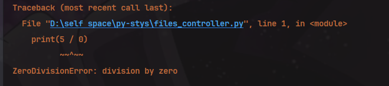
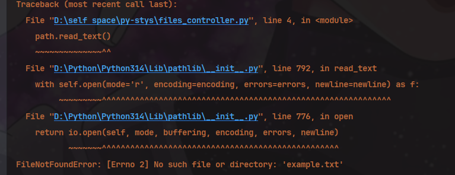

# 文件

学习处理文件， 快速分析大量数据。 

学习异常处理， 是`py`创建的特殊对象，用于管理程序运行出现的错误

学习JSON模块保存用户数据，避免程序结束后丢失

:::details 方法目录

| 方法 | 说明 |
| ---- | ---- |
|`path.read_text()`| 读取文件内容，返回字符串 |
|`path.write_text()`| 写入文件内容，覆盖原有内容 |
| `path.exists()` | 检查文件是否存在，返回布尔值 |

:::

## 读取文件

读取文件是从`pathlib`标准库(是标准库所以后面有`lib`后缀)导入`Path`模块后， 传给`Path`相对或绝对路径后, 通过读取方法读取文件内容

文件内容读取后为字符串， 使用字符串的各类方法格式化、增删内容、分割每行访问细节等操作。

```python
# 引入 pathlib 模块中的 Path 类
from pathlib import Path
# 创建 Path 对象，传入路径
path = Path('./supports/pi_digits.txt')
# 读取文件内容并去除末尾的空白字符
content = path.read_text().rstrip()
print(content)
# 访问每行的内容
content = content.splitlines()  # ['3.1415926535', '  8979323846', '  2643383279']
print_string = ''
for line in content:
    print_string += line.lstrip()
```

## 写入文件

使用`wirte_text()`方法， 将字符串写入文件， 如果文件不存在， 则创建新文件， 如果文件存在， 则覆盖原有内容。


# 异常

同js和java的`try..catch`一样,`py`使用`try-except`语句来捕获和处理异常。

未对异常进行处理时，程序会停止， 并显示一个`traceback`的错误信息。

`try...except...else`的`else`部分是可选的， 当没有异常时， 执行`else`部分。

```python
try:
    # 可能引发异常的代码
    result = 10 / 2
except ZeroDivisionError:
    # 处理除零异常
    print("Error: Division by zero is not allowed.")
else:
    # 如果没有异常，执行这里的代码
    print(f"Result is {result}")
```

## ZeroDivisionError

除数为0时， 会抛出`ZeroDivisionError`异常。



```python
try:
    print(5 / 0)
except ZeroDivisionError:
    print("Error: Division by zero is not allowed.")
```

## FileNotFoundError

当尝试打开一个不存在的文件时， 会抛出`FileNotFoundError`异常。



## pass语句

有时， 你可能想要捕获异常但不执行任何操作， 这时可以使用`pass`语句。

```python
try:
    path = Path('non_existent_file.txt')
    content = path.read_text()
except FileNotFoundError:
    pass  # 什么也不做
```

# 存储数据

保存数据，用户提供的信息等， 最简单的数据结构就是JSON，使用模块json. 而且JSON不是python特有的数据格式。

::: tip
JSON一开始是为javascript设计的， 但现在已经成为一种通用的数据交换格式， 被多种编程语言支持。
:::

## json.dumps() 和 json.loads()

`json.dumps()`将python数据结构转换为JSON字符串。

`json.loads()`将JSON字符串转换回python数据结构。

