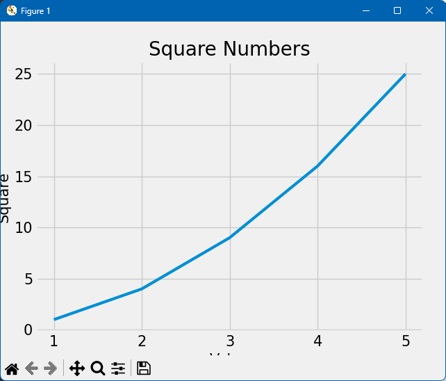

# 数据可视化

python也是可以实现数据可视化，一个流行的工具是`matplotlib`的数据绘图库。 同js的`ECharts`类似

# 安装 Matplotlib

```shell
$ python -m pip install matplotlib
```


# 折线图

```python
import matplotlib.pyplot as plt

input_values = [1, 2, 3, 4, 5]
squares = [1, 4, 9, 16, 25]
plt.style.use('fivethirtyeight') # 使用plt内置样式
fig, ax = plt.subplots()  # 创建图表对象和子图对象
ax.plot(input_values, squares, linewidth=3) # 绘制折线图，设置线宽
ax.set_title('Square Numbers', fontsize=20) # 设置标题及字体大小
ax.set_xlabel('Value', fontsize=15) # 设置x轴标签及字体大小
ax.set_ylabel('Square', fontsize=15) # 设置y轴标签及字体大小
ax.tick_params(labelsize=15) # 设置刻度标签大小

plt.show() # 显示图表

```



其余的散点图、随机漫点图、柱状图、饼图等都可以通过类似的方式绘制，具体可以参考[Matplotlib官方文档](https://matplotlib.org/stable/contents.html)。

