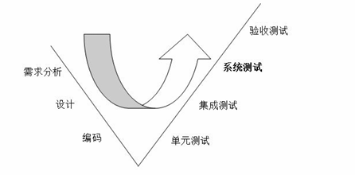
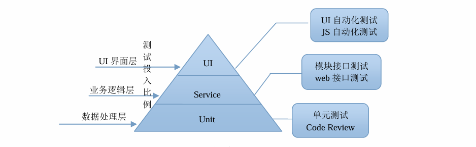
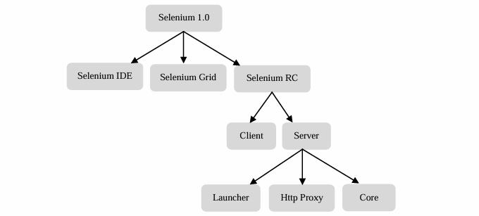

正式开始学习之前，先了解下软件测试的概念和自动化测试的概念和工具

# 软件测试分类

软件测试名词很多，从不同维度就有不同的分类方式，下面是几种常见的分类方式：

## 项目流程阶段划分

1. 单元测试(Unit Testing): 对单个子程序/具有独立能力的代码段进行测试
2. 集成测试(Integration Testing): 对模块之间的接口和交互进行测试
3. 系统测试(System Testing): 对整个系统进行测试，验证系统是否符合需求规格
4. 验收测试(Acceptance Testing): 最后一个阶段，由最终用户或客户进行的测试，验证系统是否满足业务需求

## 白盒、黑盒、灰盒测试

1. 黑盒测试(Black Box Testing): 测试人员不需要了解程序的内部结构和实现细节，只关注输入和输出
2. 白盒测试(White Box Testing): 打开盒子，研究源代码和程序执行结果。按照程序内部结构测试程序
3. 灰盒测试(Grey Box Testing): 既了解部分内部结构，又关注输入输出， 有些输出是正确，但内部的事件、标志错误，每次都通过白盒测试效率会低下

## 功能测试、性能测试

1. 功能测试(Functional Testing): 

    - 校验功能是否符合用户需求
    - 又细分为： 逻辑功能测试、见面测试、易用性测试、安装测试、兼容性测试等

2. 性能测试(Performance Testing):

    - 性能测试通过自动化测试工具模拟正常、峰值、异常负载条件对系统的各项性能指标进行的测试
    - 性能包含了**时间性能**和**空间性能**

## 手工测试与自动化测试

1. 手工测试(Manual Testing): 

    - 测试人员手动执行测试用例，通过键鼠输入，查看输出
    - 并非专业术语而是与自动化区分开来的一种测试方式

2. 自动化测试(Automated Testing):

    - 将人为驱动测试行为转换为机器执行， 测试人员设计编写测试用例后， 一步步执行测试用例，为了节省人力、时间等， 引入自动化测试概念
    - 又可分为**功能自动化测试**和**性能自动化测试**

## 冒烟、回归、随机、探索性和安全测试

1. 冒烟测试(Smoke Testing): 

    - 大规模系统测试前，验证基本功能是否实现、流程是否可行
    - 目的是尽早发现系统的重大缺陷，避免浪费时间和资源在一个有严重问题的系统上

2. 回归测试(Regression Testing):

    - 修改旧代码，修复提出的bug后，重新进行测试确认修改后没有引入新的缺陷
    - 通常在下一轮测试开始时进行，是个递归过程

3. 随机测试(Random Testing):

    - 输入数据随机，模拟用户真实操作， 发现**边缘性错误**
    - 一般放在**测试最后阶段**， 随机测试的更专业是**探索性测试**

4. 探索性测试(Exploratory Testing):

    - **是一种测试思维技术**， 没有实际方法、技术和工具
    - 强调主观能动性， 强调及时改变测试策略

5. 安全测试(Security Testing):

    - 评估系统的安全性，发现潜在的安全漏洞
    - 包括渗透测试、漏洞扫描、代码审计等方法

# 分层自动化测试

分层自动化测试区分与**传统自动化测试**， Martin Fowler大师提出的**测试金字塔提出**

> 如果没有特别说明，则本文所说的自动化测试均指基于UI的功能自动化测试

# 什么项目适合自动化测试

以下10条权衡利弊后可以对项目开展自动化测试。

1. 任务测试明确，不会频繁变动。
2. 每日构建后的测试验证。
3. 比较频繁的回归测试。
4. **软件系统界面稳定，变动少。**
5. **需要在多平台上运行的相同测试案例、组合遍历型的测试，大量的重复任务。**
6. **软件维护周期长。**
7. 项目进度压力不太大。
8. 被测软件系统开发较为规范，能够保证系统的可测试性。
9. 具备大量的自动化测试平台。
10. 测试人员具备较强的编程能力。

# 常见自动化测试工具

1. Selenium: 开源的Web应用自动化测试工具，支持多种浏览器和编程语言。
2. UFT (Unified Functional Testing): 商业自动化测试工具，支持多种应用类型和技术。强大的录制回放、对象识别和图像识别模式
3. Robot framework: 基于Python的开源自动化测试框架，支持关键字驱动测试。
4. Watir: 基于Ruby的Web应用自动化测试工具，易于使用和扩展。

# Selenium工具

Selenium主要是web app的自动化测试， 支持所有基于web的管理任务自动化。

有着以下特点：

- 开源、免费
- 多浏览器内核支持
- 多平台支持
- 多语言支持
- 简单、灵活
- 支持分布式测试用例执行

:::tip
selenium的版本如今已经是4.x版本
:::

## Selenium初次版本

selenium1.0的家谱如上。

2.0版本则是引入了webDriver概念， 使得selenium的架构更加清晰。

3.0版本和4.0版本则是移除了selenium RC， 只保留了webDriver。

## Selenium工具集

#### 1. Selenium IDE 

看到图标是录制， IDE是浏览器扩展插件， 可以录制和回放测试脚本

特点：

- 开箱即用， 快速编写测试
- 易于调试，设置断点及一场暂停
- 跨浏览器， 通过命令行组合系统与浏览器进行测试

#### 2. selenium webDriver

原生方式驱动浏览器，好像用户真实操作浏览器一样

特点：

- 简洁明快， 多种编程语言调用webDriver
- 支持全部主流浏览器
- webDriver标准是W3C标准

#### 3. Selenium Grid

支持多台机器同时运行多个基于 WebDriver的测试，减少在多浏览器和多操作系统上测试耗费的时间。

特点：

- 支持多浏览器、多版本及多操作系统
- 大幅缩短执行时间

#### 4. appium

是基于 WebDriver 标准的开源工具，主要用于移动设备的原生app自动化测试

