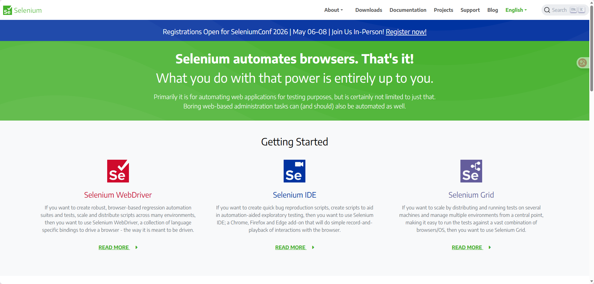
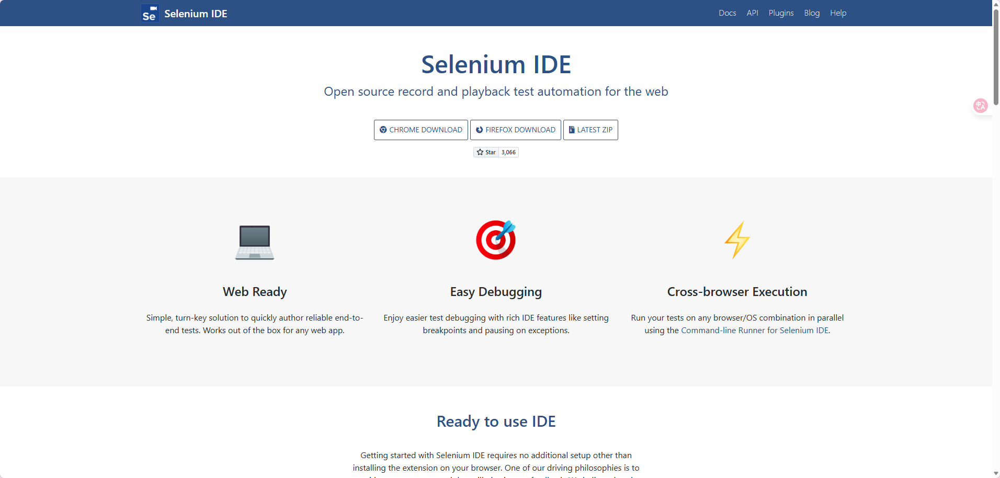

# Selenium IDE基本运用

由于IDE是浏览器的插件， 直接搜索浏览器扩展搜索然后安装即可。

也可以访问[selenium官网](https://www.selenium.dev/)进行下载安装：

# 基本操作

安装完成后， 打开浏览器右上角的插件图标， 点击Selenium IDE图标， 打开IDE。 然后开始一个很简单的**录制与回放**操作。

[//]: # (todo)

## 其他应用

核心其实编写脚本去跑一些程序， 那么就会有非测试性质的操作， 如： 抢票、抢购、刷浏览量、下载量等。 这类操作的本质是循环。

直接`insert new command`， 然后选择`command => times`, `target => 10`

记得最后在操作的最后插入`end`命令即可。
