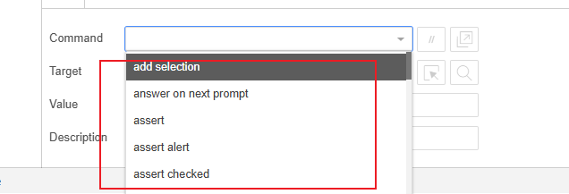
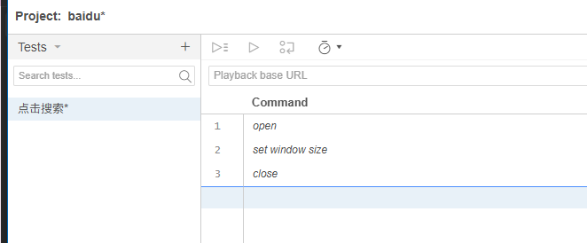
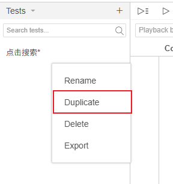
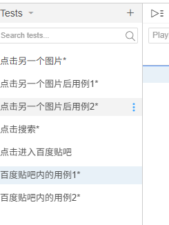
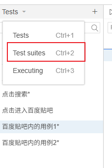
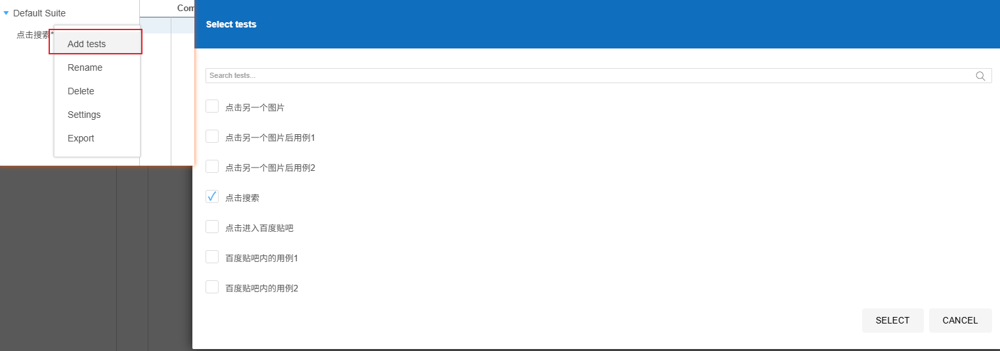

:::tip
高级运用中有创建套件(模块化管理)、了解`command`命令、命令行运行器等内容， 建议阅读。
:::

# IDE支持的5类命令

除了GUI(Graphical user Interface 用户图形界面)的用户傻瓜式操作， IDE通过命令行运行来在不同浏览器上快速运行测试



命令分为5大类， 分别是： 界面操作类、测试验证类、执行等待类、流程控制类、测试辅助类。

这里的命令特别多，放在本文最后的章节去查阅。

[IDE支持命令手册](./chapter3.md#ide支持命令手册)

# 测试套件管理

我们录制一条用例那是基本操作， 真实业务中我们会有2条、无数条用例。

## 1. 生成多个测试用例

我们现在有一条输入、并点击搜索的用例



---

我们现在增加多个测试用例： 首先复制一个并自己去录制：



---

然后手动增加一个并自己去录制：



## 2. 创建套件

假设我们现在有两个模块： 百度贴吧、百度搜图、百度搜索三个模块，那么几十几百条用例混在一起， 我们如何管理呢？

很明显我们需要一个**结构化**的管理方式， Selenium IDE提供了 **测试套件(Test Suite)** 的概念。

### 创建测试套件





# 命令行运行器

:::tip
命令行存在的意义是可以让IDE的所有测试运行在**所有浏览器上**

并且支持并行运行，也支持在Selenium Grid上运行。
:::

## 1. 安装并运行在各个浏览器

首先需要安装最新版nodejs, 在[nodejs官网](https://nodejs.org/en/)下载安装包并安装。

然后打开终端，安装命令运行器

`npm install -g selenium-side-runner`

安装完成后， 我们需要下载各个浏览器的驱动[详见4章节开头](./chapter4.md#安装各个浏览器驱动)。

然后跑命令:

`selenium-side-runner d:\Baidu.side`

:::tip
通过`selenium-side-runner --help`可以查看所有命令行参数。
:::

## 2. 常用参数设置

参数设置为: `selenium-side-runner -params(这是具体参数) url`

- 运行多浏览器命令 `selenium-side-runner -c "browserName=chrome" d:\Baidu.side`
- 修改基础url: `selenium-side-runner -b "baseUrl=https://www.baidu.com" d:\Baidu.side`
- 选取测试用例运行 `selenium-side-runner d:\Baidu.side --filter imageSearch`
- 并行运行测试用例 `selenium-side-runner -w 4 d:\Baidu.side`
- 测试结果导出为文件 `selenium-side-runner --output-directory d:\testReports d:\Baidu.side --output-format-junit/jest`

#### 指定配置文件

每次启动都去设置运行参数，我们可以创建一个YAML文件，填入配置参数

```yaml
capabilities:
  browserName: chrome
  browserVersion: latest
  'goog:chromeOptions':
    args:
      - headless
      - disable-gpu
      - window-size=1920,1080
```

第一种方式直接将配置文件和测试文件放在一个目录下，命名为`.side.yml`， 然后直接运行命令

第二种方式则是通过`--config-file "BaiduSearch.yml"`指定配置文件

# IDE支持命令手册

## 1. 界面操作类

界面操作类最常见的是`click`、`select`、`mouse over`等， 这些命令主要用于模拟用户在浏览器上的操作行为。

:::danger
此类命令，如果`fail on error`属性被设置为true， 则在命令执行失败时， 测试用例会立即终止， 并标记为失败。
:::

#### 浏览器窗口操作

| 命令                | 说明           | 参数设置(必须设置)                             | 备注                                                                        |
|-------------------|--------------|----------------------------------------|---------------------------------------------------------------------------|
| `open`            | 打开指定URL，     | Target：xx，**可以相对也可以绝对路径**              | 等待页面加载完成后才能执行下一个命令                                                        |
| `set window size` | 设置浏览器窗口大小    | Target：宽度 x 高度，格式为`widthxheight`       |                                                                           |
| `select window`   | 切换到指定的浏览器窗口  | Target为窗口名称或句柄                         |                                                                           |
| `select frame`    | 切换到指定的iframe | Target:id=frameId或index=0或relative=top | 如果多层嵌套框架iframe，那么需要多次执行操作， 返回页面顶部`relative=top`， 向外选择父框架`relative=parent` |
| `close`           | 关闭当前浏览器窗口    |                                        |                                                                           |

#### 页面元素操作

| 命令                        | 说明           | 参数设置(必须设置)                     | 备注                |
|---------------------------|--------------|--------------------------------|-------------------|
| `click`                   | 点击页面元素       | Target: 元素定位符                  |                   |
| `click at`                | 在指定坐标点击页面元素  | Target: 元素定位符，Value: x,y坐标     |                   |
| `double click`            | 双击页面元素       | Target: 元素定位符                  |                   |
| `double click at`         | 在指定坐标双击页面元素  | Target: 元素定位符，Value: x,y坐标     |                   |
| `check`                   | 选中复选框或单选按钮   | Target: 元素定位符                  |                   |
| `uncheck`                 | 取消选中复选框或单选按钮 | Target: 元素定位符                  |                   |
| `type`                    | 在输入框中输入文本    | Target: 元素定位符，Value: 输入文本      |                   |
| `edit content`            | 编辑可编辑元素的内容   | Target: 元素定位符，Value: 输入文本      |                   |
| `select`                  | 选择下拉框选项      | Target: 元素定位符，Value: 选项文本/索引/值 | value默认填写选项的文本值就好 |
| `add selection`           | 在多选框中添加选项    | Target: 元素定位符，Value: 选项文本/索引/值 |                   |
| `remove selection`        | 在多选框中移除选项    | Target: 元素定位符，Value: 选项文本/索引/值 |                   |
| `drag and drop to object` | 拖拽页面元素到另一个元素 | Target: 源元素定位符，Value: 目标元素定位符  |                   |
| `submit`                  | 提交表单         | Target: 元素定位符                  |                   |

#### 弹出框操作

| 命令                                                | 说明             | 参数设置(必须设置)    | 备注 |
|---------------------------------------------------|----------------|---------------|----|
| `choose ok on next confirmation`                  | 确认下一个确认弹出框     |               |    |                        |
| `choose cancel on next confirmation`              | 取消下一个确认弹出框     |               |    |                        |
| `answer on next prompt`                           | 回答下一个提示弹出框     | Target: 输入的文本 |    |
| `choose cancel on next prompt`                    | 取消下一个提示弹出框     |               |    |
| `webdriver choose ok on visible confirmation`     | 如果已经有确认框， 点击确定 |               |
| `webdriver choose cancel on visible confirmation` | 如果已经有确认框， 点击取消 |               |
| `webdriver answer on visible prompt`              | 如果已经有提示框， 输入文本 | Target: 输入的文本 |    |
| `webdriver choose cancel on visible prompt`       | 如果已经有提示框， 点击取消 |               |

#### 键鼠模拟操作

| 命令              | 说明          | 参数设置(必须设置)                 | 备注                               |
|-----------------|-------------|----------------------------|----------------------------------|
| `mouse down`    | 鼠标按下左键，未松开  | Target: 元素定位符              |                                  |
| `mouse down at` | 在指定坐标按下鼠标左键 | Target: 元素定位符，Value: x,y坐标 | 支持相对坐标系的偏移量调整                    |
| `mouse up`      | 鼠标松开左键      | Target: 元素定位符              |                                  |
| `mouse up at`   | 在指定坐标松开鼠标左键 | Target: 元素定位符，Value: x,y坐标 | 支持相对坐标系的偏移量调整                    |
| `mouse move`    | 移动鼠标到指定元素   | Target: 元素定位符              |                                  |
| `mouse move at` | 移动鼠标到指定坐标   | Target: 元素定位符，Value: x,y坐标 | 支持相对坐标系的偏移量调整                    |
| `send keys`     | 发送按键        | Target: 元素定位符，Value: 按键文本  | 支持组合键，特殊按键可以使用按键符 `${KEY_ENTER}` |

## 2. 测试验证类

测试验证类主要是验证应用程序的状态是否符合预期， 如： 页面标题是否正确、 页面元素是否存在。

:::tip

命令主要分为两类： 验证(verify)和断言(assert)

验证类型的命令在验证失败时， 测试用例会继续执行下去， 并记录失败信息。

断言类型的命令在断言失败时， 测试用例会立即终止， 并标记为失败。

:::

#### 断言类

| 命令                           | 说明                           | 参数设置(必须设置)                | 备注                               |
|------------------------------|------------------------------|---------------------------|----------------------------------|
| `assert`                     | 断言变量值为期望值                    | Target: 变量名，Value: 期望值    |                                  |
| `assert title`               | 断言页面标题为期望值                   | Target: 期望标题              |                                  |
| `assert text`                | 断言页面包含期望文本                   | Target: 元素                |                                  |
| `assert not text`            | 断言页面不包含期望文本                  | Target: 元素定位符，Value: 期望文本 |                                  |
| `assert value`               | 断言页面元素的值为期望值                 | Target: 元素定位符，Value: 期望值  | 对于复选框选应该填写on(表示已勾选) 或 off(表示未勾选) |
| `assert checked`             | 断言复选框或单选按钮被选中                | Target: 元素定位符             |                                  |
| `assert not checked`         | 断言复选框或单选按钮未被选中               | Target: 元素定位符             |                                  |
| `assert selected label`      | 断言下拉框选中期望选项(选中项的文本是否包含了期望文本) | Target: 元素定位符，Value: 期望文本 |                                  |
| `assert selected value`      | 断言下拉框选中期望选项(选中项的值是否等于期望值)    | Target: 元素定位符，Value: 期望值  |                                  |
| `assert not selected value`  | 断言下拉框未选中期望选项                 | Target: 元素定位符，Value: 期望值  |                                  |
| `assert editable`            | 元素是否处于可编辑的状态                 | Target: 元素定位符             |                                  |
| `assert not editable`        | 检查元素是否处于不可编辑状态               | Target（元素的定位表达式）          |                                  |
| `assert element present`     | 检查元素是否在页面代码中存在               | Target（元素的定位表达式）          |                                  |
| `assert element not present` | 检查元素是否在页面代码中不存在              | Target（元素的定位表达式）          |                                  |
| `assert alert`               | 检查是否出现过警告弹出框，并且是否包含期望文本      | Target（期望的文本）             |                                  |
| `assert confirmation`        | 检查是否出现过确认弹出框，并且是否包含期望文本      | Target（期望的文本）             |                                  |
| `assert prompt`              | 检查是否出现过信息输入框，并且是否包含期望文本      | Target（期望的文本）             |                                  |

#### 验证类

| 命令                           | 说明                               | 参数设置                                          | 备注         |
|------------------------------|----------------------------------|-----------------------------------------------|------------|
| `verify`                     | 类似于 `assert`                     | `Target`: 变量名，`Value`: 期望值                    | 记录失败但不停止用例 |
| `verify title`               | 类似于 `assert title`               | `Target`: 期望标题                                | 同上         |
| `verify text`                | 类似于 `assert text`                | `Target`: 元素定位符，`Value`: 期望文本                 | 同上         |
| `verify not text`            | 类似于 `assert not text`            | `Target`: 元素定位符，`Value`: 期望文本                 | 同上         |
| `verify value`               | 类似于 `assert value`               | `Target`: 元素定位符，`Value`: 期望值（复选框用 `on`/`off`） | 同上         |
| `verify checked`             | 类似于 `assert checked`             | `Target`: 元素定位符                               | 同上         |
| `verify not checked`         | 类似于 `assert not checked`         | `Target`: 元素定位符                               | 同上         |
| `verify selected label`      | 类似于 `assert selected label`      | `Target`: 元素定位符，`Value`: 期望文本（选中项文本包含关系）      | 同上         |
| `verify selected value`      | 类似于 `assert selected value`      | `Target`: 元素定位符，`Value`: 期望值（选中项值相等关系）        | 同上         |
| `verify not selected value`  | 类似于 `assert not selected value`  | `Target`: 元素定位符，`Value`: 期望值                  | 同上         |
| `verify editable`            | 类似于 `assert editable`            | `Target`: 元素定位符                               | 同上         |
| `verify not editable`        | 类似于 `assert not editable`        | `Target`: 元素定位表达式                             | 同上         |
| `verify element present`     | 类似于 `assert element present`     | `Target`: 元素定位表达式                             | 同上         |
| `verify element not present` | 类似于 `assert element not present` | `Target`: 元素定位表达式                             | 同上         |

## 3. 执行等待类

#### 有条件等待

| 命令                              | 说明              | 参数设置                                      | 备注                                                                                     |
|---------------------------------|-----------------|-------------------------------------------|----------------------------------------------------------------------------------------|
| `wait for element editable`     | 等待指定元素变为可编辑状态   | `Target`: 元素的定位表达式，`Value`: 最长等待时间（单位是毫秒） |                                                                                        |
| `wait for element not editable` | 等待指定元素变为不可编辑状态  | `Target`: 元素的定位表达式，`Value`: 最长等待时间（单位是毫秒） |                                                                                        |
| `wait for element present`      | 等待指定元素出现在页面代码中  | `Target`: 元素的定位表达式，`Value`: 最长等待时间（单位是毫秒） |                                                                                        |
| `wait for element not present`  | 等待指定元素未出现在页面代码中 | `Target`: 元素的定位表达式，`Value`: 最长等待时间（单位是毫秒） |                                                                                        |
| `wait for element visible`      | 等待指定元素在页面上可     | `Target`: 元素的定位表达式，`Value`: 最长等待时间（单位是毫秒） | 比 `wait for element present` 条件更苛刻，要求元素在代码中存在且不能为 `display:none`、不能被其他元素遮盖，且高度/宽度不能为 0 |
| `wait for element not visible`  | 等待指定元素在页面上不可见   | `Target`: 元素的定位表达式，`Value`: 最长等待时间（单位是毫秒） |                                                                                        |

#### 无条件等待

| 命令          | 说明                        | 参数设置                    | 备注            |
|-------------|---------------------------|-------------------------|---------------|
| `set speed` | 设置整个测试的执行速度（即设置每条命令的执行间隔） | `Target`: 执行间隔时间（单位是毫秒） | 默认值为 `0`（无延时） |
| `pause`     | 等待固定的时间                   | `Target`: 等待时间（单位是毫秒）   | 用于强制暂停测试执行    |

## 4. 流程控制类

#### 循环

| 命令          | 功能                                                    | 参数                                                                   |
|-------------|-------------------------------------------------------|----------------------------------------------------------------------|
| `times`     | 创建一个执行 N 次的固定循环。                                      | `Target` 表示循环次数；`Value` 表示最大循环次数，可选，主要用于防止无限循环，默认值为 1000             |
| `while`     | 创建一个根据布尔值执行的循环，只要提供的条件表达式值为 `true` 就会一直循环。            | `Target` 表示 JavaScript 条件表达式，要求返回布尔值；`Value` 表示最大循环次数，可选，默认值为 1000   |
| `for each`  | 根据数组长度执行的循环，依次遍历数组中的各项。                               | `Target` 表示 JavaScript 数组变量的名称；`Value` 表示循环变量的名称，每次循环将在该变量中存放当前遍历项的值 |
| `do`        | 创建一个至少执行一次的循环。该循环以 `repeat if` 命令作为循环体的结尾             | —                                                                    |
| `repeat if` | `do` 循环的循环体结束，由布尔值决定是否再执行循环；如果提供的条件表达式值为 `true`，则继续循环 | `Target` 表示 JavaScript 条件表达式，要求返回布尔值                                 |

#### 分支

| 命令        | 功能                                                     | 参数                                   |
|-----------|--------------------------------------------------------|--------------------------------------|
| `if`      | 如果提供的条件表达式值为 `true`，则执行接下来的命令（构成分支的一部分）                | `Target` 表示 JavaScript 条件表达式，要求返回布尔值 |
| `else if` | 分支的另一部分；当前面 `if`/`else if` 条件不满足时，若此条件为 `true` 则执行对应命令 | `Target` 表示 JavaScript 条件表达式，要求返回布尔值 |
| `else`    | 分支的默认部分；当前面所有 `if`/`else if` 条件均不满足时执行                 | —                                    |

#### 通用

| 命令    | 功能                                                            | 参数 |
|-------|---------------------------------------------------------------|----|
| `end` | 作为循环命令（`times`, `while`, `for each`）和分支命令（`if`, `else if`）的结尾 | —  |

## 5. 测试辅助类

#### 辅助调试

| 命令         | 功能                    | 参数               | 备注        |
|------------|-----------------------|------------------|-----------|
| `debugger` | 在执行处中断并进入调试模式         | —                | 触发断点，便于调试 |
| `echo`     | 将指定消息输出到日志或回放中，主要用于调试 | `Target`: 要输出的消息 | —         |

#### 辅助执行

| 命令                     | 功能                                     | 参数                                                  | 备注                    |
|------------------------|----------------------------------------|-----------------------------------------------------|-----------------------|
| `run`                  | 运行另一个用例或 `.side` 测试文件                  | `Target`: 要运行的用例名或文件路径                              | 在当前运行上下文中调用其他测试用例     |
| `run script`           | 在当前页面执行一段 JavaScript 代码                | `Target`: 要注入/执行的 JavaScript 代码                     | 可插入并执行 script 片段      |
| `execute script`       | 在页面上下文同步执行 JavaScript 并返回结果            | `Target`: JavaScript 代码，`Value`: 返回结果要存储的变量名（可选）    | 返回值可用于后续断言或存储         |
| `execute async script` | 在页面上下文异步执行 JavaScript（支持 Promise）并返回结果 | `Target`: 异步 JavaScript 代码，`Value`: 返回结果要存储的变量名（可选） | 适用于异步操作，需显式回调/resolve |

#### 辅助存储

| 命令                    | 功能                    | 参数                                          | 备注                         |
|-----------------------|-----------------------|---------------------------------------------|----------------------------|
| `store`               | 将指定文本或表达式的结果存入变量      | `Target`: 要存储的文本或表达式，`Value`: 变量名（不带\$）     | 通用存储命令                     |
| `store title`         | 将当前页面标题存入变量           | `Target`: —，`Value`: 变量名                    | 存储页面 title                 |
| `store text`          | 将指定元素的可见文本存入变量        | `Target`: 元素定位符，`Value`: 变量名                | 获取元素 innerText/textContent |
| `store value`         | 将输入元素的 value 值存入变量    | `Target`: 元素定位符，`Value`: 变量名                | 适用于 `<input>` 等            |
| `store attribute`     | 将元素的某个属性值存入变量         | `Target`: 元素@属性名（例如 `foo@bar`），`Value`: 变量名 | 用于获取自定义属性或 href 等          |
| `store window handle` | 将当前窗口句柄存入变量           | `Target`: —，`Value`: 变量名                    | 用于多窗口场景切换                  |
| `store json`          | 将 JSON 字符串或表达式的结果存入变量 | `Target`: JSON 字符串或表达式，`Value`: 变量名         | 可用于保存序列化的对象                |
| `store xpath count`   | 将匹配指定 XPath 的节点数存入变量  | `Target`: xpath 表达式，`Value`: 变量名            | 返回匹配节点的数量                  |