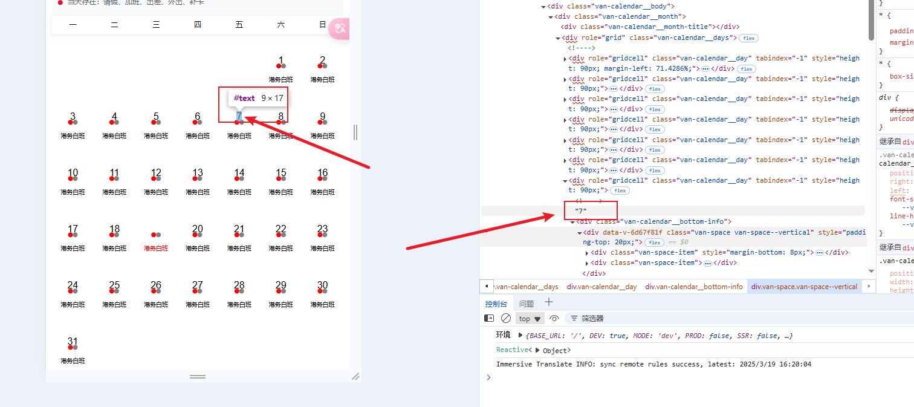

Damn！Tread Hole! <Badge type="danger" text="version 0.1" />
# 组件库

## elementPlus

当给组件传递**对象**参数`data`，而组件内的顶级标签恰好为`el-table`时， 那么就会触发报错。

::: danger

由于传递是个对象，最顶级的`el-table`又接受了`attribute`，`elementPlus`底层用了`data.includes`方法会导致报错。

:::

::: code-group

```vue [parent.vue]
<template>
  <component is="Child" :data="rowData" >
</template>

<script setup>
import { ref } from 'vue'

const propData = ref({})

</script>
```

```vue{2} [child.vue]
<template>
  <el-table :data="tableData" > <!-- [!code error] -->
    <el-table-column prop="name" label="Name" />
    <el-table-column prop="age" label="Age" />
  </el-table>
</template>

<script setup>
import { ref } from 'vue'

const tableData = ref([])
</script>
```

:::

:::details 解决方法
- **传递prop避开data属性命名的冲突**
- `vue`特性的`attribute`透传可通过`defineOptions().inheritAttrs = false`解决
:::

## vant

### `Calendar`

::: danger

日历组件内的日期， 直接渲染成了**字符**， 想要重置修改样式！发现做不到！



:::

**通过提供的`formatter: (date) => date`来生成div标签， 代码如下：**

```vue
<Calendar :formatter="calendarFormatter"/>

<script setup>
const calendarFormatter = (day) => {
  day.text = h('div', {
    class: 'custom_day',
  }, day.text)
  return day
}
</script>

<style lang="scss" scoped>
::v-deep {
  .custom_day {
    // xxx
  }
}
</style>
```

## 日历组件

::: danger

市面的日历组件未能满足需求， 需要自己封装一个完整版功能的日历组件

1. elementplus的日历组件：
   - 无法设置头部的周日排序在后面
   - 初始样式化太丑
   - border线很丑
<!-- 2. vant：
   -  -->
:::


# vue

## 封装$dialog

::: warning

在封装$dialog时， 控制台警告: 

`Non-function value encountered for default slot. Prefer function slots for better performance.`

由于vue3中插槽内容要为函数

:::

```js [dialogPlugin.js]

() => h(ElDialog, {
    modelValue: visible.value,
  },
  {
    default: options.content, // [!code --]
    default: () => options.content, // [!code ++]
    footer: () => options.showFooter ? h('div', 
      { class: ['dialog-footer', options.footerClass ] },
      [
        options.showCancelBtn && h(ElButton, { onClick: close, type: options.cancelType }, options.cancelText ), // [!code --]
        options.showCancelBtn && h(ElButton, { onClick: close, type: options.cancelType }, () => options.cancelText ), // [!code ++]
        //.....
      ]
    ) : null,
  });

```

## `<component />`常识

在**setup组合api中**， 使用`<component />`标签，传递一个组件实例过去。

::: warning

假设定义了一个对象，其中有个属性名为`component`, 那么也会触发警告: 

**Vue received a Component that was made a reactive object. This can lead to unnecessary performance overhead and should be avoided by marking the component with `markRaw` or using `shallowRef` instead of `ref`.**

:::

::: details 解决方法

```js
obj = reactive({
  component: markRaw(component)
})
```

::: 
