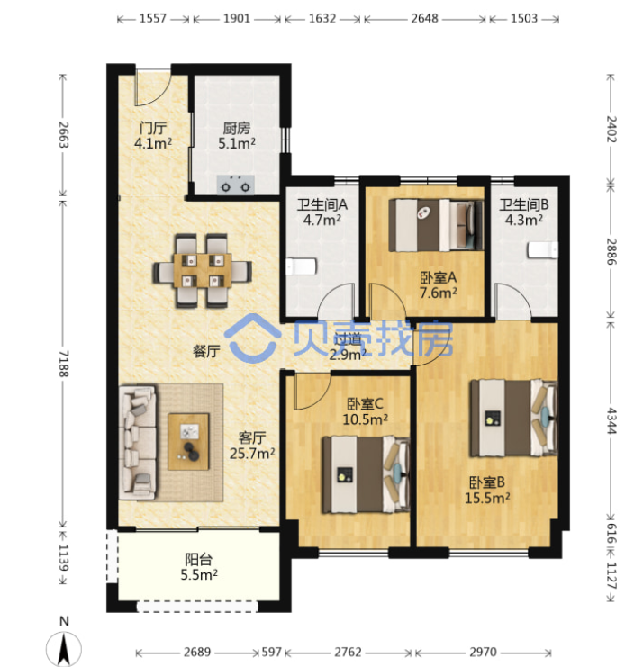
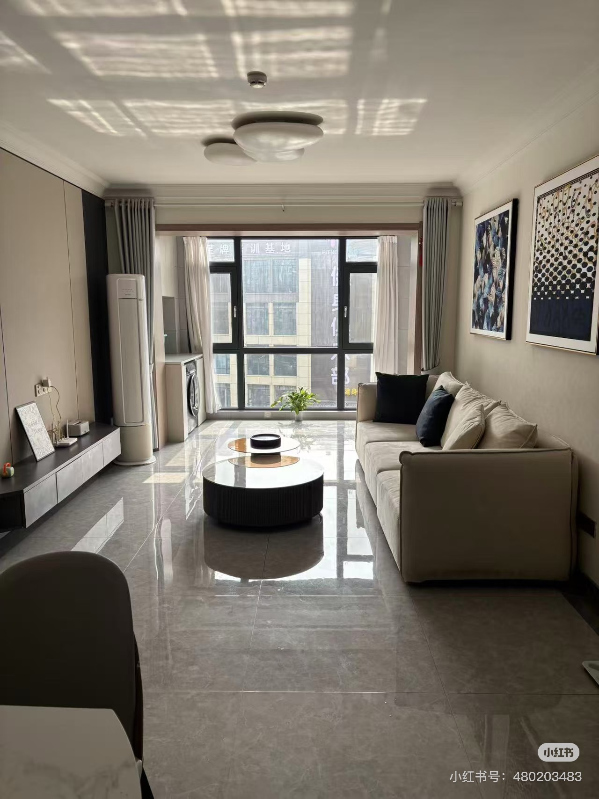
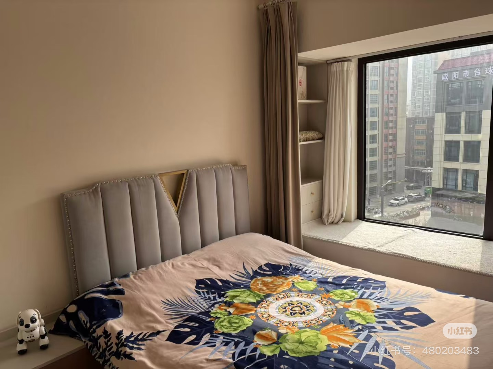
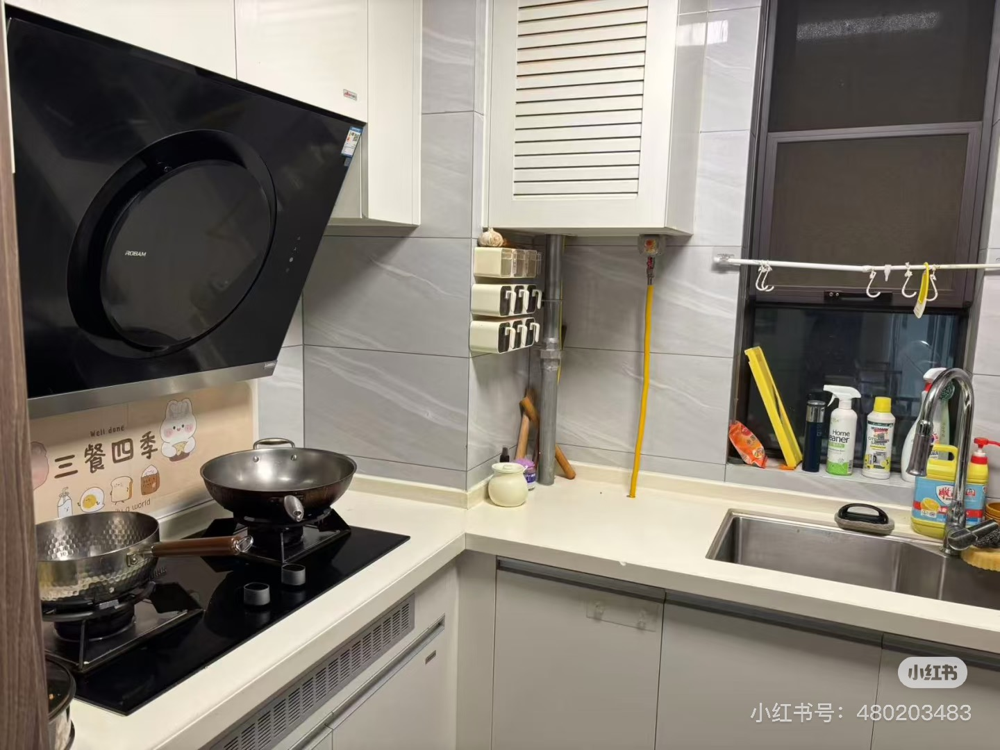
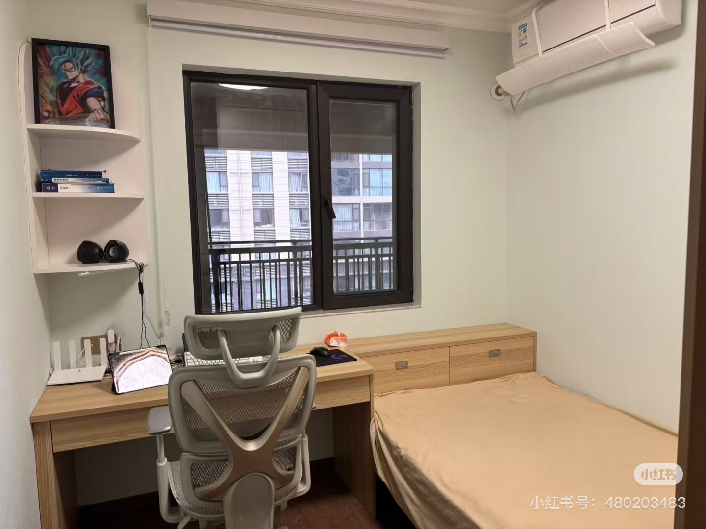
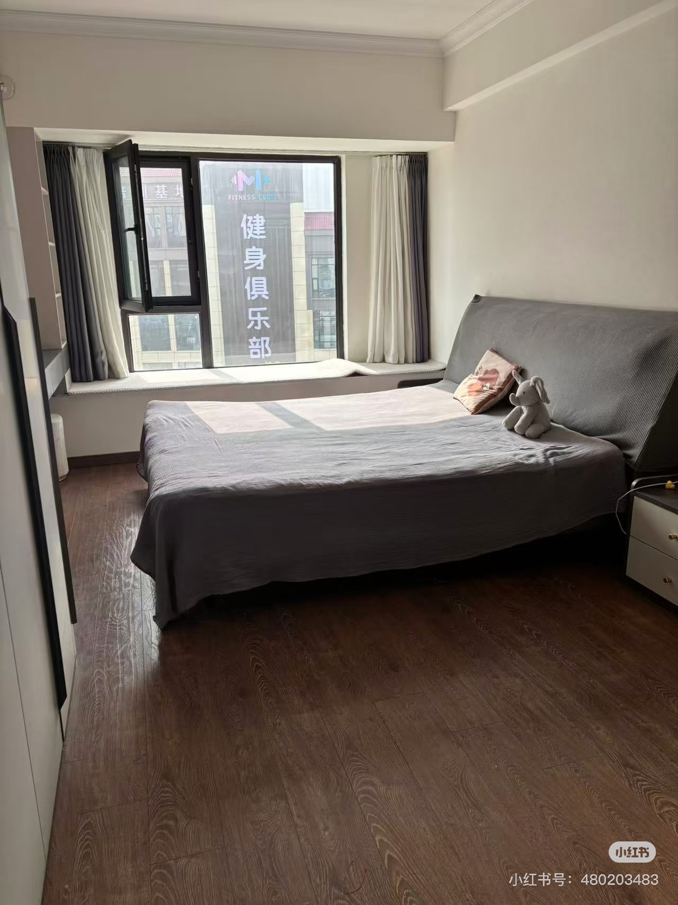
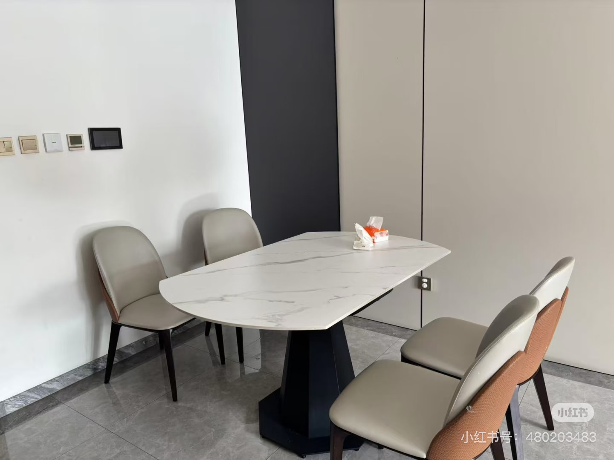
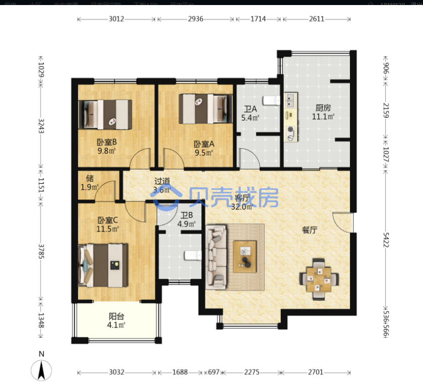
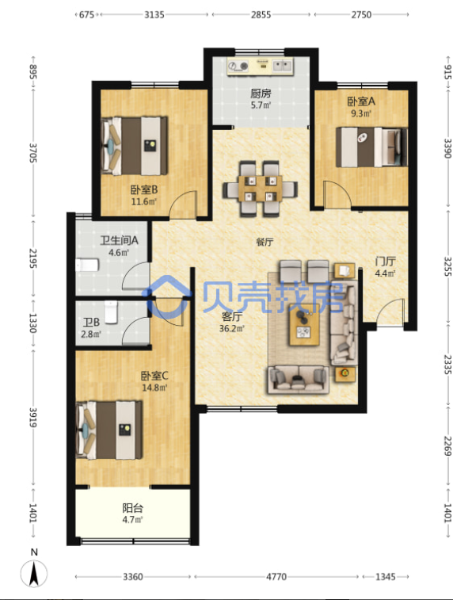
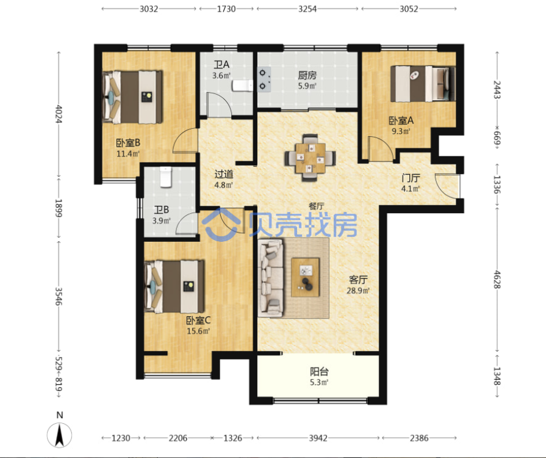

# 秦都府一二期 - 10-24年

## 第一套婚房刚需出售 

刚接触时候是115w 最多110w

【关于房子】
1. 面积：房屋面积114.69
1.楼位楼层：位于二期最前面的14号楼栋，2梯4户，采光可以。
1. 户型：三室两厅，南北通透，空气流通性好。
1. 采光: 全明户型，生活便利。
1. 装修：精装修，全屋定制，家电齐全，自住标准。
【关于小区】
1. 交通便利：咸阳市中心地段七厂十字
1. 小区环境：绿化率高达30%，楼间距宽，
1. 周边配套：能满足日常生活需求。
1. 教育资源丰富有自带幼儿园、新投幼儿园、天王幼儿园、机关幼儿园和天王小学，天王中学书包。

## 距离工作点

- 开车9分钟: 西兰路立交 => 联盟三路 => 
- 公交15路35分钟
- 骑车是15分钟

## 学区

- 幼儿园、西关、二印小初

## 平米和价格

- 临高铁便宜 是85-90
- 不临高铁是115-120
 
# 荣盛·锦绣观邸 - 00-23年

## 距离工作点

- 开车3分钟
- 公交24分钟
- 骑车10分钟

## 学区

- 二印、联盟小学、德瑞幼儿园

## 平米和价格

- 130 均价 7500 = 975000
- 118 均价 6500 = 767000

# 华泰玉景台 - 08到22年

毛坯交付

## 距离工作点

- 开车5分钟
- 公交25分钟
- 骑车13分钟 不用过马路

## 学区

- 二印、联盟小学、德瑞幼儿园

## 平米和价格

- 129 均价是6200 成交价差不多是=800000

# 融创·玖园 - 00-23年

# 丽彩珠泉新城·花间树 - 00-23年

## 距离工作点

- 开车9分钟
- 公交35分钟
- 骑车18分钟

## 学区

- 古渡小学、古渡中学

## 平米和价格

- 130 均价 7100 = 923000